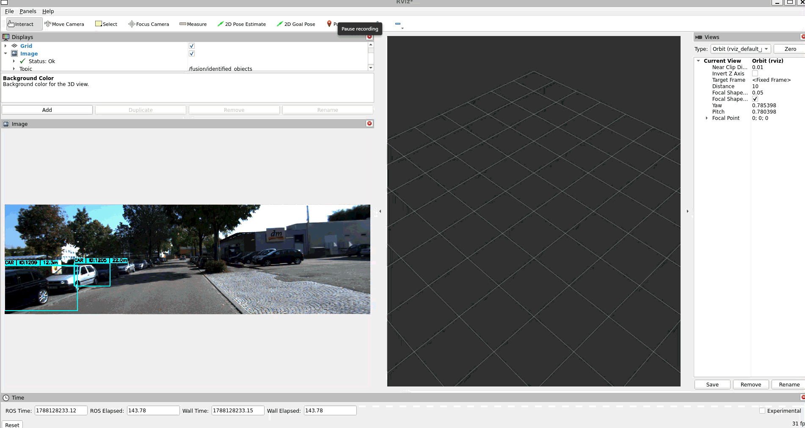

# LiDAR_image_fusion
------------------------------------

- Project the 3D objects tracked by LiDAR onto the camera image plane, then perform IoU matching between the projected bounding boxes and the YOLO 2D detections. Finally, overlay the YOLO class label, LiDAR Track ID, and distance directly onto the image.

```
   LiDAR Tracking                           Camera
/lidar_track/tracked_objects         /kitti/image/color/left
        │                                     │
        │  3D Marker                          │ Image
        ▼                                     ▼
  3D bounding box                       OpenCV image
        │                                     │
        │                                     │
        └─────── 3D → 2D Projection ──────────┘
                       │
                       ▼
                LiDAR 2D bounding box
                       │
                       │ IoU matching
                       ▼
              YOLO 2D detections
                       │
                       ▼
              Matched Object
                       │
                       ▼
Draw rect for detection + Class + Track ID + Distance
                       │
                       ▼
             /fusion/identified_objects
```

four key tasks:

1. Subscription and Synchronization: It simultaneously subscribes to and synchronizes the 2D bounding boxes from YOLOv11 and the 3D tracking boxes from the LiDAR tracking node (Kalman Filter).

2. 2D-3D Association: It utilizes a projection matrix to project the 3D boxes onto the 2D image plane, then calculates the IoU (Intersection over Union) between the projected boxes and the YOLO 2D boxes. A high overlap confirms that both boxes belong to the same object.

3. Label Memory: It assigns semantic labels (e.g., car, pedestrian) to the 3D tracking boxes. If the camera temporarily loses sight of an object due to occlusion or lighting changes, the LiDAR 3D box retains the assigned label.

4. Classified Output: It publishes successfully fused and classified objects to /fusion/identified_objects 

### Geometric Transformation Breakdown

The roles of these three matrices in the geometric transformation chain are detailed below:

| Matrix Variable Name | Mathematical Essence | Role in the Geometric Chain |
| :--- | :--- | :--- |
| `velo_to_cam0_extrinsic` | Extrinsic Matrix $[R \vert t]$ | Transforms 3D points from the **LiDAR coordinate system** to the **Cam0 (Reference Camera) coordinate system**. |
| `cam0_rectification` | Rectification Matrix $[R \vert 0]$ | Applies a rotation correction to the image plane at the Cam0 position to **rectify the field of view**. |
| `cam2_projection_rectified` | Projection Matrix $K \cdot [I \vert t]$ | Translates coordinates from Cam0 to the **Cam2 (Color Camera)** position, then applies the intrinsic focal length to **project 3D points onto 2D pixels**. |


