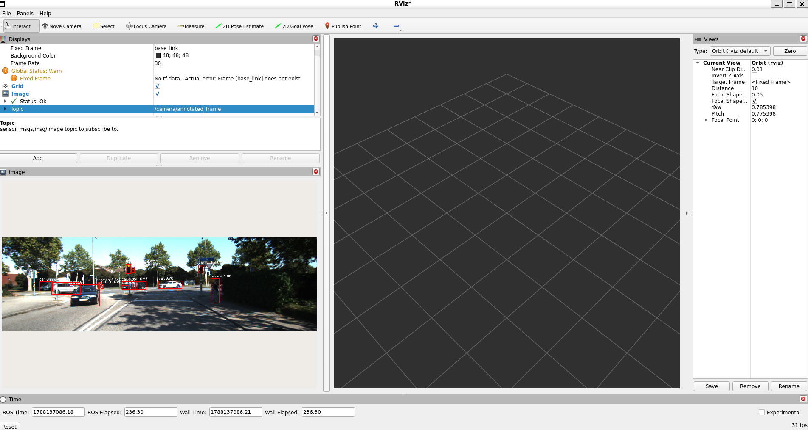

# Camera Object Detection
----------------------------------

## YOLOv11
- Run object detection on camera input

- Core Flow

```
                    ROS 2
                      │
                      │ /kitti/image/color/left
                      ▼
              sensor_msgs/Image
                      │
                      │ CvBridge
                      ▼
                OpenCV image
                 (NumPy array)
                      │
                      ▼
                  YOLO11n
                      │
                      ▼
             YOLO detection results
                      │
              ┌───────┴────────┐
              │                │
        bounding box       class + score
              │                │
              └───────┬────────┘
                      ▼
             vision_msgs/Detection2D
                      │
                      ▼
               Detection2DArray
                      │
                      ▼
       /camera/object_detections
       
```

- Receive input from camera, subscribe topic `/kitti/image/color/left`
- Convert ROS2 image to cv image for YOLOv11 input
- Run object detection
- Put result into ROS2 detection message
- Convert annonated cv image to ROS2 image message
- Publishe detection and annonated image message

1. Create package for camera object detection, which support cpp and python

```
ros2 pkg create --build-type ament_cmake --dependencies rclcpp rclpy --license Apache-2.0 lidar_camera_perception
```

2. Create a folder to store python script

```
cd lidar_camera_perception
mkdir lidar_camera_perception
cd lidar_camera_perception
code camera_object_detection.py
```

3. Before build package, make sure give the excuation permission to `camera_object_detection.py`

```
chmod +x camera_object_detection.py
```

* This line must be the first line of your Python file to make it an executable script in Linux
```
#!/usr/bin/env python3
```

4. Modify `CMakeLists.txt` to install python script

- Add required package

```
find_package(vision_msgs REQUIRED)  #  Detection2DArray
find_package(sensor_msgs REQUIRED)  #  Image
```

- Installs your Python script into the ROS 2 workspace

```
install(PROGRAMS
  lidar_camera_perception/camera_object_detection.py
  DESTINATION lib/${PROJECT_NAME}
)
```

5. Build

```
colcon build --symlink-install --packages-select lidar_camera_perception
```

6. Test

- Run object detection

```
ros2 run lidar_camera_perception camera_object_detection.py
```

- Run input

```
ros2 bag play kitti_dataset_0009
```


## Pytorch

- Faster R-CNN (COCO 91 classes)

Run object detection for pytorch object detection

```
ros2 run lidar_camera_perception pytorch_camera_object_detection.py
```


