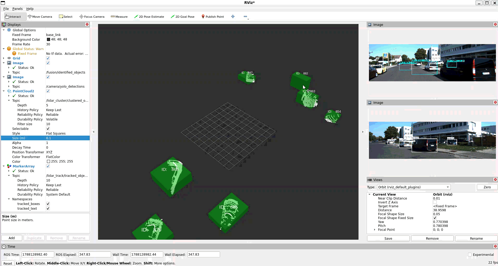
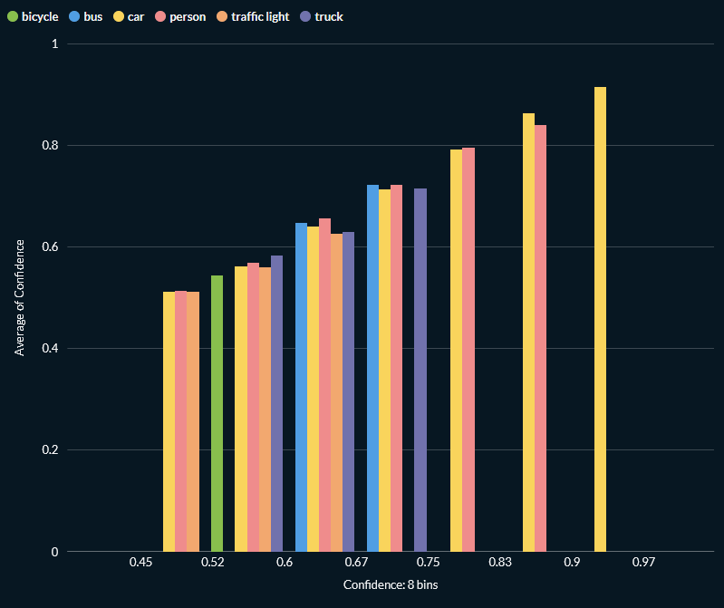
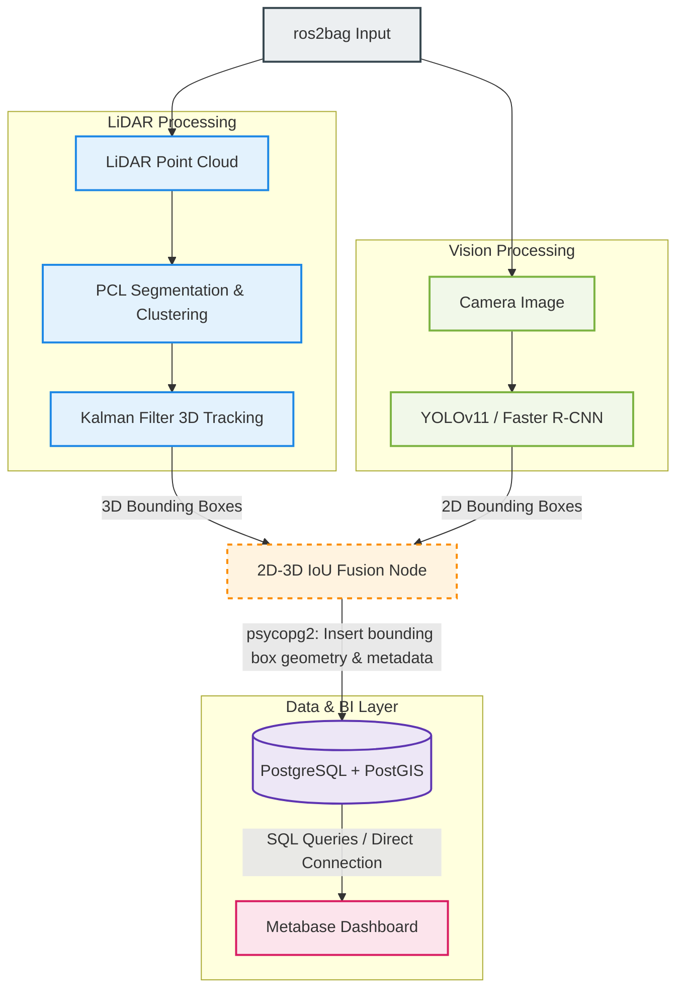

# ROS2 LiDAR-Camera Perception Pipeline
------------------------------------
This project implements a real-time 3D multi-object tracking and sensor fusion pipeline using **ROS2**, combining **LiDAR point clouds** and **camera images** for robust environment perception.




## Environment

* **OS:** Ubuntu 24.04 LTS (WSL2 compatible)
* **ROS 2 Version:** Jazzy Jalisco (Python 3.12)
* **CUDA Version:** 12.1 (for PyTorch deep learning workloads)
* **Database:** PostgreSQL 16+ with PostGIS extension (required for 2D spatial polygon handling)
* **Containerization:** Docker Engine (v20.10+) & Docker Compose v2+
* **Python Dependencies:** psycopg2, open3d, ultralytics, torch/torchvision
  
## Core Features

*   **Data Replay**: Leverages `ros2bag` to replay and process recorded sensor data streams.
*   **2D Object Detection**: Detect and classify 2D objects in camera frames.
    *   **Option 1: YOLOv11**: Optimized single-stage detector delivering high frame rates on edge hardware.
    *   **Option 2: PyTorch Faster R-CNN**: Robust two-stage regional proposal network utilizing official weights pre-trained on **COCO 91 classes**.
* **Frustum-to-Voxel 3D Detection**: Uses 2D YOLO bounding boxes to crop raw LiDAR point clouds into localized frustums, dramatically reducing computational complexity before feeding them into **Frustum PointNet**.
*   **3D Point Cloud Segmentation**: Employs **PCL (Point Cloud Library)** to filter out ground planes and isolate obstacles.
*   **Object Clustering**: Groups isolated 3D points into distinct object clusters using PCL.
*   **3D Multi-Object Tracking**: Applies a **Kalman Filter** tracker to maintain identities (Track IDs) across frames.
*   **LiDAR-Camera Fusion**: Projects 3D tracking boxes onto 2D image planes using a geometric extrinsic-intrinsic chain, performing IoU matching to bind YOLO semantic labels onto 3D LiDAR tracks.
*   **Database Logging**: Streams and records real-time object tracking metadata into a PostgreSQL data warehouse under the camera_yolo_detections table for persistent telemetry storage.
*   **BI Data Visualization**: Connects Metabase to the PostgreSQL database to effortlessly create interactive charts, monitor detection frequency, and analyze AI inferences without writing SQL.

## Learning Objectives

By developing this project, the primary technical goals and core competencies achieved include:

*   **Multi-Sensor Spatial Calibration**: Mastered the coordinate transformation chain ($LiDAR \rightarrow Cam0 \rightarrow Rectified\ Cam0 \rightarrow Cam2$) to accurately align 3D spatial points with 2D pixels.
*   **Sensor Fusion & Data Association**: Implemented real-time 2D-3D bounding box matching using Intersection over Union (IoU) and greedy assignment algorithms to bind semantic labels to spatial objects.
*   **3D Point Cloud Processing**: Gained hands-on experience with the **Point Cloud Library (PCL)** for ground plane segmentation (RANSAC) and Euclidean cluster extraction.
*   **State Estimation & Tracking**: Understood and applied **Kalman Filtering** to track moving obstacles in 3D space, ensuring identity persistence (Track ID) under occlusion.
*   **Modern ROS2 Architecture**: Designed and synchronized asynchronous node communication (Subscriptions, Synchronizers, and Custom Publishers) in a modular ROS2 ecosystem.
*   **Deep Learning Deployment**: Integrated YOLOv11 inferences into a live ROS2 pipeline and engineered a database sink to bridge real-time robotics metadata with Business Intelligence (BI) software.

## Execution Options & Class Mapping

The node automatically re-maps traffic categories depending on your selected runtime backend option:

| Target Class | YOLOv11 Class ID | PyTorch Faster R-CNN (COCO 91) ID |
| :--- | :---: | :---: |
| `person` | 0 | 1 |
| `bicycle` | 1 | 2 |
| `car` | 2 | 3 |
| `motorcycle` | 3 | 4 |
| `bus` | 5 | 6 |
| `truck` | 7 | 8 |
| `traffic_light` | 9 | 10 |
| `stop_sign` | 11 | 12 |

## Pipeline Architecture


### Architectural Pipeline Breakdown
1. **Perception Feed**: `ros2bag` synchronizes and broadcasts raw LiDAR point clouds and high-resolution camera frames.
2. **LiDAR Subsystem**: The Point Cloud Library (PCL) handles ground plane RANSAC segmentation and Euclidean clustering. A Kalman Filter assigns and tracks unique spatial IDs over multi-frame timelines.
3. **Vision Subsystem**: Neural object detection inference (YOLOv11 or Faster R-CNN) generates 2D image coordinates.
4. **Data Fusion**: Geometric matrices map 3D boundaries into 2D projections. Greedy Hungarian-like IoU algorithms align AI semantic classifications with 3D targets.
5. **Analytics Injection**: The fusion pipeline utilizes a custom Python `DatabaseLogger` class via `psycopg2` to convert bounding box centers and extents into standard WKT format geometries (`POLYGON`), logging data frames safely into PostgreSQL for live Business Intelligence (BI) insights.
   
## Setup

### Repository for KITTI publisher

* Navigate to your ROS 2 workspace's source directory and clone this project:

```
git clone https://github.com/umtclskn/ros2_kitti_publishers.git
```

* Recommend make it to ros2bag

### Install System Dependencies

* Install the required system tools and development libraries:

```
sudo apt update
sudo apt install libpcap-dev ros-jazzy-cv-bridge -y
```

### Configure the Python Virtual Environment

* Create the venv inside your home directory

```
python3 -m venv --system-site-packages ~/ros2_venv
source ~/ros2_venv/bin/activate
```

* Upgrade package management tools

```
pip install --upgrade pip setuptools
```

* Resolve dependency conflicts for ROS 2 Jazzy core packages

```
pip install pyyaml jinja2 typeguard
```

* Install ROS 2 build tools and external ML frameworks, version of numpy for Yolo need <2, and make opencv compatible with numpy <2

```
pip install ultralytics catkin_pkg
pip install "numpy<2"
pip install "opencv-python<4.10.0"
```

* Pip check

```
pip check
```

should show 

```
No broken requirements found.
```

* Verify

```
python3 -c "import catkin_pkg; print(catkin_pkg.__file__)"
```

-------------------------------------
@ reference
https://github.com/lim425/ros2_lidar_camera_perception/tree/main
