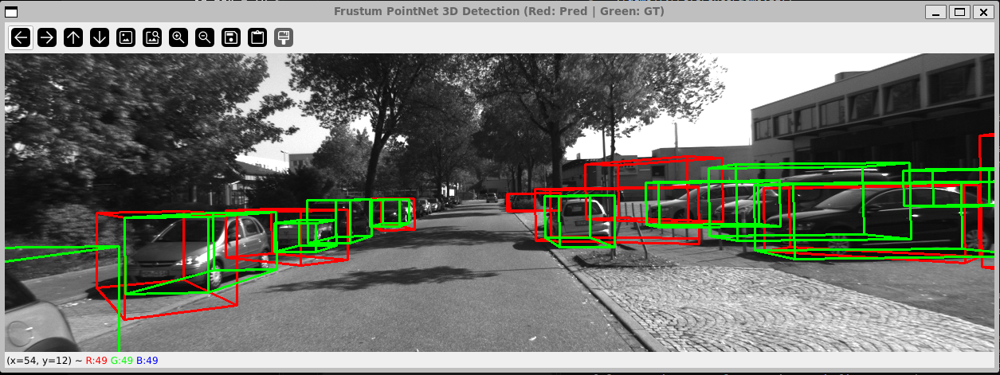
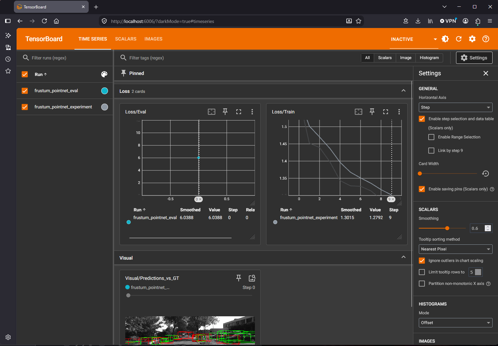

# Frustum-to-Voxel 3D Object Detection for Autonomous Systems
-------------------------------------

## Install CUDA

```
wget https://developer.download.nvidia.com/compute/cuda/repos/wsl-ubuntu/x86_64/cuda-wsl-ubuntu.pin
sudo mv cuda-wsl-ubuntu.pin /etc/apt/preferences.d/cuda-repository-pin-600
wget https://developer.download.nvidia.com/compute/cuda/repos/wsl-ubuntu/x86_64/cuda-keyring_1.0-1_all.deb
sudo dpkg -i cuda-keyring_1.0-1_all.deb
sudo apt-get update
sudo apt-get -y install cuda-nvcc-12-1 cuda-cudart-dev-12-1 cuda-libraries-dev-12-1
```

- Configure Environment Paths

```
echo 'export PATH=/usr/local/cuda-12.1/bin:$PATH' >> ~/.bashrc
echo 'export LD_LIBRARY_PATH=/usr/local/cuda-12.1/lib64:$LD_LIBRARY_PATH' >> ~/.bashrc
source ~/.bashrc
```

- Verify Compiler Installation

```
nvcc --version
```


## Pytorch

```
pip install torch torchvision --index-url https://download.pytorch.org/whl/cu121
```

- because of this pytorch will upgrade numpy, so need to uninstall numpy and install numpy < 2.0

```
pip install "tifffile<2025.0.0"
pip install "numpy<2.0"
```


## Install Dependencies

```
pip install open3d
pip install "scipy<1.14"
sudo apt install libgl1 libegl1 libxrandr2 libxinerama1 libxcursor1 libxi6 mesa-utils
sudo apt update && sudo apt install -y libgles2 libgles2-mesa-dev
```


## Repository Structure

```
script/
├── test_frustum_crop.py         # Main test script for projection, frustum extraction, and Open3D visualization
├── frustum_pointnet_pipeline.py # Validation tool for pipeline inspection and single-frame testing
├── train_frustum_pointnet.py    # End-to-end training loop script with checkpoint saving
├── eval_frustum_pointnet.py     # Quantitative evaluation script calculating Mean Smooth L1 Loss across validation data
├── data_clean_KITTI.py          # KITTI 3D Tracklet Cleaner and XML DOM Sanitizer
└── README.md
```


## Learning Objective

- **Data Cleaning & Quality Control (data_clean_KITTI.py):** Master XML DOM manipulation and geometric depth validation to programmatically detect and strip degenerate bounding box poses ($Z \le 0.1$) while preserving dataset structure.

- **Sensor Fusion & Geometric Projection (test_frustum_crop.py):** Learn how to chain extrinsic, rectification, and projection calibration matrices to map LiDAR point clouds into camera image planes and crop 2D-guided 3D frustums.

- **3D Deep Learning & Regression (frustum_pointnet_pipeline.py):** Understand how to normalize dynamic point clouds into fixed-shape tensors via zero-centering and padding, and train a neural network to regress 7D bounding box parameters using Smooth L1 Loss.

## LiDAR-Camera Fusion & Frustum PointNet 3D Detection

**Significantly reducing 3D spatial search and computational burden:**
Using **2D YOLO bounding boxes** to crop **raw LiDAR point clouds** into localized frustums dramatically **reduces computational costs**, allowing 3D models to focus exclusively on relevant object regions instead of processing the entire scene.

A modular perception pipeline that combines 2D object detection (YOLO) with LiDAR point clouds using KITTI calibration parameters to extract 3D frustums and predict accurate 3D bounding boxes.

### Pipeline Architecture

### test_frustum_crop.py

1. **2D Detection:** YOLOv8 detects objects in synchronized RGB images and extracts 2D bounding boxes $(u_1, v_1, u_2, v_2)$.
2. **Calibration & Projection:** Loads raw KITTI calibration files (`calib_velo_to_cam.txt`, `calib_cam_to_cam.txt`) and pre-computes the unified 3D-to-2D projection matrix:
   $$\mathbf{M}_{\text{proj}} = \mathbf{P}_{\text{rect\_02}} \times \mathbf{R}_{\text{rect\_00}} \times \mathbf{T}_{\text{velo\_to\_cam0}}$$
3. **Frustum Cropping:** Projects LiDAR points onto the image plane, filters out points behind the camera ($Z \le 0$), and isolates 3D points falling within each YOLO 2D bounding box.
4. **3D Box Estimation:** Feeds the cropped 3D frustum point cloud into Frustum PointNet to regress oriented 3D bounding boxes.

### frustum_pointnet_pipeline.py

Serves as a visualization tool for pipeline validation and single-frame inspection.

Can be run directly whenever you want to quickly check if data alignment, YOLO detection results, or 3D bounding box projections are implemented correctly.

1. **Core Purpose:** End-to-end prototype validating a Frustum-to-Voxel 3D object detection framework.

2. **2D-3D Cross-Domain Integration:** Leverages YOLOv11 for 2D bounding box detection and applies KITTI calibration matrices to project and crop corresponding LiDAR 3D point cloud frustums.

3. **Data Normalization & Batch Alignment:** Applies local zero-centering to cropped point clouds, standardizing dynamic point counts into a fixed tensor shape of (Batch, 512, 3) via random sampling and zero-padding.

4. **PyTorch Tensor Flow Validation:** Tests the custom SimpleFrustumPointNet model to ensure proper tensor ingestion, feature extraction, and regression head output for 7D 3D bounding box parameters.

   - Center Coordinates ($x, y, z$): The 3D center position of the object relative to the sensor frame in meters (e.g., $x = 12.5$, $y = 1.2$, $z = -0.5$).
   - Dimensions ($l, w, h$): The physical size of the object in meters, representing length, width, and height (e.g., length $= 4.2$, width $= 1.8$, height $= 1.5$ for a sedan).
   - Orientation ($\theta$): The yaw rotation angle around the vertical axis in radians (e.g., $\theta = 0.15$).

   ```
   # [x, y, z, length, width, height, yaw]
   bounding_box_7d = [12.5, 1.2, -0.5, 4.2, 1.8, 1.5, 0.15]
   ```

5. **Loss Calculation & Optimization Validation:** Computes Smooth L1 Loss (F.smooth_l1_loss) between the model's 7D regression outputs and aligned ground truth targets to evaluate prediction errors and validate gradient-ready optimization loops.

### data_clean_KITTI.py

KITTI 3D Tracklet Cleaner and Visualizer. This script processes KITTI dataset tracklet XML files by:

1. **Core Purpose:** Parses KITTI dataset 3D tracklet XML files, extracting fundamental object dimensions (height, width, length) and sequential trajectory motion poses.

2. **Coordinate Transformation:** Applies extrinsic calibration and rectification matrices (such as velo_to_cam0_ext and projection matrices) to map 3D bounding box corner vertices accurately into the camera coordinate system.

3. **Depth Verification & Filtering:** Inspects the camera-frame depth coordinate ($Z$) of every box vertex to identify projection anomalies, stray artifacts, or objects positioned too close to the sensor.

- validation Condition: depth (Z <= 0.1)

4. **XML Sanitization & Persistence:** Automatically targets and removes invalid inner pose entries (pose_item) directly from the XML Document Object Model (DOM) tree without breaking file structure, then saves the updated file as a cleaned dataset.

5. **Synchronization & Visualization:** Projects valid 3D bounding box coordinates onto synchronized 2D camera image planes and renders complete 12-edge wireframes for qualitative pipeline inspection.

### train_frustum_pointnet.py

1. **Define PyTorch Dataset class:** Inherit from torch.utils.data.Dataset. Scan all image, LiDAR bin, and label paths in the KITTI directory within init, and implement single-frame YOLO detection, frustum point-cloud extraction, and padding to 512 points within getitem.

2. **Create DataLoader:** Encapsulate data into an iterable batch data structure using torch.utils.data.DataLoader(dataset, batch_size=4, shuffle=True).

3. **Implement training loop and optimizer:** Initialize model = SimpleFrustumPointNet() and optimizer = torch.optim.Adam(model.parameters(), lr=0.001).

4. **Execute multi-epoch training:** Wrap with an outer loop for epoch in range(num_epochs):, sequentially calling optimizer.zero_grad(), loss.backward(), and optimizer.step() in the inner loop.

5. **Save model weights:** Track the average loss of each epoch, and use torch.save(model.state_dict(), 'frustum_pointnet.pth') to save the weights to disk when achieving the best-performing (lowest loss) model.

### eval_frustum_pointnet.py

Computes quantitative evaluation metrics (Mean Smooth L1 Loss) across the validation dataset to objectively assess 3D bounding box regression accuracy instead of relying solely on visual checks.

1. **Validation Dataset Loader (KittiValDataset):** Automatically scans image and point cloud directories, executes YOLO 2D detection, isolates object frustums, and aligns them with KITTI XML tracklet ground-truth poses.

2. **GPU-Accelerated Inference:** Configures PyTorch to execute model inference and loss calculation seamlessly on available NVIDIA CUDA devices.

3. **Performance Benchmarking:** Feeds batched tensors through SimpleFrustumPointNet using loaded weights (frustum_pointnet_30epoch.pth) to output a standardized quantitative error score.




## Visualizing Training and Evaluation with TensorBoard

To monitor training loss curves and inspect 3D bounding box visual comparisons (Red: Predictions vs. Green: Ground Truth) interactively:

1. **Launch the TensorBoard server from your workspace root:**

```
tensorboard --logdir=runs
```

2. Open your web browser and navigate to:

```
http://localhost:6006/
```

- Scalars Tab: Track Loss/Train progression per epoch and Loss/Eval metrics.
- Images Tab: Inspect rendered Visual/Predictions_vs_GT image frames.




## Speedup trainning

### RAM Caching & Data Pipeline Optimization

To eliminate disk I/O bottlenecks and accelerate batch processing for training, the dataset pipeline implements an in-memory RAM caching strategy.

* **Pre-Generation (__init__):** Runs YOLO once per frame beforehand to index every bounding box proposal separately, avoiding CUDA multi-threading crashes and capturing multiple objects per image.

* **Frustum Extraction (__getitem__):** Keeps your exact point-cloud projection, 2D box filtering, zero-center normalization, and 512-point uniform sampling logic intact.

* **DataLoader Usage:** When instantiating your DataLoader, explicitly set `num_workers=0` to ensure safe interaction with YOLO model weights.

* **pin_memory:** Allocates tensors in pinned (page-locked) host memory, accelerating CPU-to-GPU data transfers.

* **Automatic Mixed Precision (AMP):** Wrap your forward pass and loss calculation using PyTorch's native AMP scaler.This forces the GPU to execute matrix operations in mixed-precision (FP16/FP32), significantly reducing memory usage and accelerating training throughput.

   - Execution: Forces the GPU to perform matrix operations using a mix of FP16 and FP32 precision via PyTorch's native GradScaler.

   - Benefit: Significantly reduces memory consumption and accelerates training throughput on compatible GPUs without sacrificing model accuracy.

---------------------------

## Issue

- cannot view 3d in wsl

```
export XDG_SESSION_TYPE=x11
unset WAYLAND_DISPLAY
```
